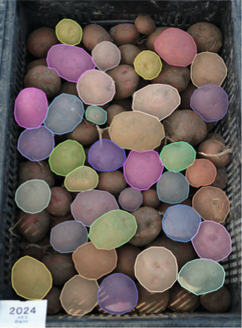
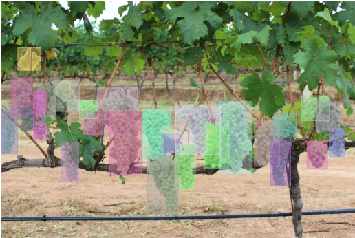

# PotatoSeg

This github repo consists of the potato and grape dataset we used in the paper. They are both in coco format (annotations in .json), 
and already in train-val-test split

We also included a simple script to visualize the annotations

Make sure you have all the dependencies set up by running

```
pip install -r requirements.txt
```

## Potato Dataset

To visualize the dataset in coco_format. run 

```
python coco_vis.py
```

by default it will visulize a random image in the training set of the potato dataset together with the ground truth segmentation.



We also included original output from labelme when we manually annotate them. See folder potato_labelme for more detail.


## Grape Dataset
We also included the grape dataset in coco format and already in train-val-test split. run 
```
python coco_vis.py grape
```
if want to visulaze grape dataset with annotations in coco instead.




For the original grape dataset with .jpg images and annotations in .npy format, please refer to the github repo: [grape dataset](https://github.com/thsant/wgisd#:~:text=Embrapa%20WGISD%20(Wine%20Grape%20Instance,grape%20varieties%20taken%20on%20field.
)
